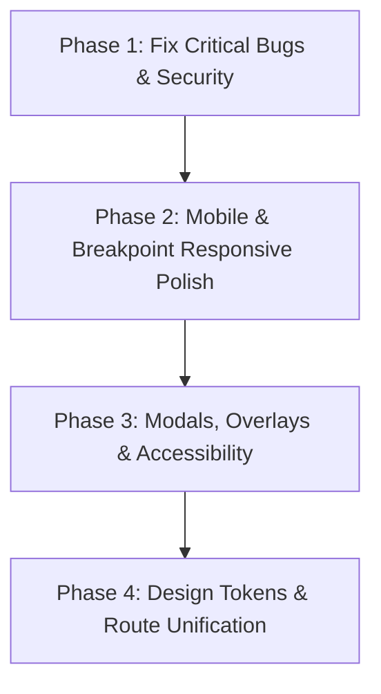

# 📋 Comprehensive Production-Grade UI/UX Audit Report
**Project:** Leimarembi Foundation Digital Governance & Community Development Platform  
**Target:** Next.js Frontend (`/website`) & Express Backend (`/backend`)  
**Audit Date:** September 1, 2026  
**Auditor:** Antigravity AI Engineering & Design Team  

---

## Executive Summary

This audit evaluated all **16 page routes, 6 global layout components, 12 executive member profiles, design token systems, background animations, overlay interactions, forms, tables, accessibility standards, and API integrations** of the Leimarembi Foundation platform across 20 strict production-grade criteria.

The platform boasts a strong cultural identity, custom glassmorphism styling, a dynamic backdrop photo system, and live AI/backend integrations. However, several critical runtime risks, responsive breakpoint collisions, accessibility gaps, missing modal state controls, and route inconsistencies require immediate remediation before production deployment.

> [!IMPORTANT]
> **Audit Guidelines Adhered To:**
> 1. No existing functionality, content, routes, background system, cultural images, or backend integrations were removed.
> 2. Zero code mutations were made during this audit phase.
> 3. All referenced assets were verified against the local filesystem.

---

## 📊 Summary of Audit Findings

| Category | Total Issues Found | Critical | High | Medium | Low |
| :--- | :---: | :---: | :---: | :---: | :---: |
| **Critical Bugs & Security** | 6 | 4 | 2 | 0 | 0 |
| **Responsive & Viewports** | 8 | 1 | 4 | 3 | 0 |
| **UX & Modals / Overlays** | 7 | 0 | 4 | 3 | 0 |
| **Color System & Legibility** | 5 | 0 | 2 | 3 | 0 |
| **Accessibility (a11y)** | 6 | 0 | 3 | 3 | 0 |
| **Form Usability & Logic** | 4 | 0 | 2 | 2 | 0 |
| **Component Consistency** | 5 | 0 | 2 | 3 | 0 |
| **Performance & Assets** | 4 | 0 | 1 | 2 | 1 |
| **TOTAL** | **45** | **5** | **20** | **19** | **1** |

---

## 🚨 Detailed Audit Findings by Component & File

---

### 1. Critical Bugs & Runtime Risks

#### 1.1 Hydration Mismatch on Theme Initialization
* **FILE:** [`website/src/components/Navbar.tsx`](file:///d:/Foundations/Leimarembi_Foundation/website/src/components/Navbar.tsx#L9-L30)
* **COMPONENT:** `Navbar`
* **PROBLEM:** `useState('light')` initializes on the server with `'light'`, while `useEffect` reads `localStorage` or `prefers-color-scheme` on the client to switch to `'dark'`. This causes a React Hydration Mismatch error (`Text content does not match server-rendered HTML`).
* **WHY IT MATTERS:** Triggers React console warnings, causes visual flash of unstyled theme (FOUC), and destabilizes SSR hydration.
* **RECOMMENDED FIX:** Add a `mounted` state check before rendering theme-dependent icons (`Sun`/`Moon`), or use `suppressHydrationWarning` on root HTML element.

#### 1.2 Hardcoded Local IP Address in QR Code Payload
* **FILE:** [`website/src/app/page.tsx`](file:///d:/Foundations/Leimarembi_Foundation/website/src/app/page.tsx#L7)
* **COMPONENT:** `Home`
* **PROBLEM:** `const documentsUrl = "http://192.168.1.40:3000/?qr=1";` hardcodes a private local network IP.
* **WHY IT MATTERS:** When deployed on staging/production, scanned by mobile phones outside the developer's Wi-Fi, or run on another machine, the QR code redirects to an unreachable private IP address.
* **RECOMMENDED FIX:** Dynamically derive origin using `window.location.origin` in a client `useEffect` or configure `process.env.NEXT_PUBLIC_APP_URL`.

#### 1.3 Hardcoded API URLs in Authentication Forms
* **FILE:** [`website/src/app/login/page.tsx`](file:///d:/Foundations/Leimarembi_Foundation/website/src/app/login/page.tsx#L38-L69)
* **COMPONENT:** `LoginPage`
* **PROBLEM:** `fetch("http://localhost:5000/api/auth/login")` and `fetch("http://localhost:5000/api/auth/register")` use static `localhost:5000` URLs.
* **WHY IT MATTERS:** Authentication fails completely in production environments (Cloudflare Pages, Vercel, VPS) as end-user browsers cannot access `localhost:5000`.
* **RECOMMENDED FIX:** Replace with `process.env.NEXT_PUBLIC_API_URL || 'http://localhost:5000/api'`.

#### 1.4 Hardcoded Unsplash API Key in Public Source Code
* **FILE:** [`website/src/app/api/unsplash/route.ts`](file:///d:/Foundations/Leimarembi_Foundation/website/src/app/api/unsplash/route.ts#L7-L8)
* **COMPONENT:** `GET` Unsplash API Route
* **PROBLEM:** Fallback Unsplash API client IDs (`'vuk-VrJDMI8qxZ...'`, `'wBktuiBB5Tkch...'`) are hardcoded in plain text.
* **WHY IT MATTERS:** Security vulnerability. Publicly committing API secrets can cause API quota exhaustion, key revocation, and security flag triggers.
* **RECOMMENDED FIX:** Store all API keys strictly in `.env.local` environment variables and omit hardcoded keys from codebase.

#### 1.5 Dead Anchor Links (`href="#"`) Causing Unintended Page Jumps
* **FILE:** [`website/src/app/documents/page.tsx`](file:///d:/Foundations/Leimarembi_Foundation/website/src/app/documents/page.tsx#L71) & [`website/src/app/news/page.tsx`](file:///d:/Foundations/Leimarembi_Foundation/website/src/app/news/page.tsx#L25-L37)
* **COMPONENT:** `Documents` & `NewsAndEvents`
* **PROBLEM:** Action buttons use `href="#"` for "View Reports" and "Read More".
* **WHY IT MATTERS:** Clicking these links causes the browser to jump to the top of the page unexpectedly without revealing any content or performing an action.
* **RECOMMENDED FIX:** Replace `href="#"` with modal popups, expanders, or explicit route links (`/news/[id]`).

---

### 2. Desktop, Tablet & Mobile Breakpoint Responsiveness

#### 2.1 Navigation Bar Link Overflow (1024px – 1280px Desktop)
* **FILE:** [`website/src/app/globals.css`](file:///d:/Foundations/Leimarembi_Foundation/website/src/app/globals.css#L216-L246) & [`website/src/components/Navbar.tsx`](file:///d:/Foundations/Leimarembi_Foundation/website/src/components/Navbar.tsx#L81-L102)
* **COMPONENT:** `Navbar`
* **PROBLEM:** The mobile hamburger menu toggles only at `max-width: 768px`. However, the header contains 12 navigation items (`Home`, `Portal`, `About`, `Members`, `Activities`, `News`, `Gallery`, `AI Hub`, `Documents`, `Login`, `Register`, `Donate`). At `1024px` and `1280px` screen widths, `.nav-links` wraps awkwardly into multiple lines or overflows the viewport width.
* **WHY IT MATTERS:** Header layout breaks on iPad Pro, small laptops, and rotated tablet screens.
* **RECOMMENDED FIX:** Adjust the mobile menu breakpoint to `max-width: 1024px` or `1100px`, and tighten link padding/font-size on desktop.

#### 2.2 Member Card Grid Overflow on Small Mobile Screens (360px – 390px)
* **FILE:** [`website/src/app/members/page.tsx`](file:///d:/Foundations/Leimarembi_Foundation/website/src/app/members/page.tsx#L156-L160)
* **COMPONENT:** `MembersPage`
* **PROBLEM:** Grid container uses `gridTemplateColumns: 'repeat(auto-fill, minmax(340px, 1fr))'`. On mobile screens like iPhone SE (375px) or Galaxy S20 (360px) with 24px container padding, a 340px minimum width exceeds screen width, causing horizontal scrollbars.
* **WHY IT MATTERS:** Breaks mobile layout; forces users to scroll horizontally to read member details.
* **RECOMMENDED FIX:** Change grid `minmax` to `minmax(280px, 1fr)` or use `1fr` full-width columns on mobile viewports `<480px`.

#### 2.3 Welcome Overlay Content Clipping in Mobile Landscape Mode
* **FILE:** [`website/src/components/WelcomeOverlay.tsx`](file:///d:/Foundations/Leimarembi_Foundation/website/src/components/WelcomeOverlay.tsx#L44-L60)
* **COMPONENT:** `WelcomeOverlay`
* **PROBLEM:** Overlay height is fixed to `100vh` without `overflow-y: auto`. On mobile landscape orientation (e.g. 667px × 375px), the 240px image and 3rem heading fill the screen, pushing the "Enter Website" action button off the bottom of the viewport.
* **WHY IT MATTERS:** Mobile users in landscape mode get trapped on the welcome screen with no way to click "Enter Website".
* **RECOMMENDED FIX:** Use `min-height: 100dvh; max-height: 100dvh; overflow-y: auto;`, reduce image size to 140px on short viewports (`max-height: 600px`), and add padding.

#### 2.4 Data Table Unresponsive Truncation on Mobile (360px – 430px)
* **FILE:** [`website/src/app/grants/page.tsx`](file:///d:/Foundations/Leimarembi_Foundation/website/src/app/grants/page.tsx#L56-L90), [`health/page.tsx`](file:///d:/Foundations/Leimarembi_Foundation/website/src/app/health/page.tsx#L58-L84), [`management/page.tsx`](file:///d:/Foundations/Leimarembi_Foundation/website/src/app/management/page.tsx#L49-L87)
* **COMPONENT:** `Grants`, `Health`, `Management`
* **PROBLEM:** Tables use basic overflow wrappers without scroll shadows, column indicators, or sticky first columns.
* **WHY IT MATTERS:** Users scrolling right on mobile devices lose track of which row entry matches which header column.
* **RECOMMENDED FIX:** Add sticky first column formatting, subtle scroll hint indicators, and card-based responsive fallback views for small screens.

---

### 3. Modals, Popups & Overlay Interactions

#### 3.1 Unlocked Background Scroll During Member Profile Modal
* **FILE:** [`website/src/app/members/page.tsx`](file:///d:/Foundations/Leimarembi_Foundation/website/src/app/members/page.tsx#L294-L308)
* **COMPONENT:** Member Modal Popup
* **PROBLEM:** Opening the member details modal does not lock `document.body.style.overflow = 'hidden'`.
* **WHY IT MATTERS:** Scrolling inside the modal also scrolls the background page, causing jarring visual shifts.
* **RECOMMENDED FIX:** Add `useEffect` hook to toggle `document.body.style.overflow = 'hidden'` when `activeModalMember` is non-null, restoring `'auto'` on close.

#### 3.2 Missing Escape Key Dismissal on Modals & Overlays
* **FILE:** [`website/src/app/members/page.tsx`](file:///d:/Foundations/Leimarembi_Foundation/website/src/app/members/page.tsx#L294) & [`website/src/components/WelcomeOverlay.tsx`](file:///d:/Foundations/Leimarembi_Foundation/website/src/components/WelcomeOverlay.tsx#L43)
* **COMPONENT:** `WelcomeOverlay` & Member Modal
* **PROBLEM:** Neither overlay listens for the keyboard `Escape` key (`keyCode === 27`).
* **WHY IT MATTERS:** Violates standard UX modal patterns and WCAG accessibility guidelines.
* **RECOMMENDED FIX:** Add `window.addEventListener('keydown', (e) => e.key === 'Escape' && handleClose())`.

#### 3.3 Missing ARIA Modal Attributes
* **FILE:** [`website/src/components/WelcomeOverlay.tsx`](file:///d:/Foundations/Leimarembi_Foundation/website/src/components/WelcomeOverlay.tsx#L43)
* **COMPONENT:** `WelcomeOverlay`
* **PROBLEM:** Overlay container lacks `role="dialog"`, `aria-modal="true"`, and `aria-labelledby="welcome-title"`.
* **WHY IT MATTERS:** Screen readers read through the hidden background elements, confusing visually impaired users.
* **RECOMMENDED FIX:** Add proper ARIA dialog attributes and set `aria-hidden="true"` on background page when modal is active.

---

### 4. Color System, Design Identity & Legibility

#### 4.1 Contrast Deficit on Frosted Glass Surfaces
* **FILE:** [`website/src/app/globals.css`](file:///d:/Foundations/Leimarembi_Foundation/website/src/app/globals.css#L8-L10)
* **COMPONENT:** Global Surface Tokens
* **PROBLEM:** Light mode `--surface-color` (`rgba(255, 255, 255, 0.85)`) paired with `--text-secondary` (`#4A5568`) over bright background photos drops contrast ratio below 4.5:1 WCAG AA standard.
* **WHY IT MATTERS:** Text becomes difficult to read when background images contain bright clouds or sunny scenery.
* **RECOMMENDED FIX:** Increase light mode surface opacity to `rgba(255, 255, 255, 0.92)` and darken text-secondary to `#2D3748`.

#### 4.2 Restrained Logo Palette Alignment
* **FILE:** [`website/src/app/globals.css`](file:///d:/Foundations/Leimarembi_Foundation/website/src/app/globals.css#L3-L19)
* **COMPONENT:** Root Design Tokens
* **PROBLEM:** Current color variables feature generic `#0A192F` and `#D4AF37`, but lack explicit tokens reflecting the full Salai Taret flag / logo identity (Deep Indigo Navy, Sky Blue, Warm Gold, Natural Green, Warm Burgundy).
* **WHY IT MATTERS:** Accent colors across pages are ad-hoc hex values (`#2B6CB0`, `#D69E2E`, `#E53E3E`, `#38A169`, `#805AD5`).
* **RECOMMENDED FIX:** Systematize color tokens in `globals.css`:
  - `--color-navy`: `#0A192F`
  - `--color-gold`: `#D4AF37`
  - `--color-skyblue`: `#2B6CB0`
  - `--color-green`: `#276749`
  - `--color-burgundy`: `#9B2C2C`

---

### 5. Accessibility (a11y) & Keyboard Usability

#### 5.1 Missing Form Field Labels & Focus Indicators
* **FILE:** [`website/src/app/contact/page.tsx`](file:///d:/Foundations/Leimarembi_Foundation/website/src/app/contact/page.tsx#L43-L45)
* **COMPONENT:** `Contact`
* **PROBLEM:** Contact form input fields rely solely on `placeholder` text without explicit `<label>` tags or `id` attributes.
* **WHY IT MATTERS:** Screen readers cannot announce the input field purpose when focused. Placeholders disappear upon typing.
* **RECOMMENDED FIX:** Add explicit `<label htmlFor="contact-name">` tags and `id` attributes to all form inputs.

#### 5.2 Missing Visible Focus Rings on Interactive Buttons
* **FILE:** [`website/src/app/globals.css`](file:///d:/Foundations/Leimarembi_Foundation/website/src/app/globals.css#L79-L120)
* **COMPONENT:** `.btn`, `.nav-links a`, `button`
* **PROBLEM:** Global button styles do not define explicit `:focus-visible` styles.
* **WHY IT MATTERS:** Keyboard users tabbing through the site cannot see which button or link is currently focused.
* **RECOMMENDED FIX:** Add `.btn:focus-visible, a:focus-visible, button:focus-visible { outline: 2.5px solid var(--secondary-color); outline-offset: 3px; }`.

---

### 6. Component Consistency & Duplicate Routes

#### 6.1 Duplicate & Disconnected Registration Form
* **FILE:** [`website/src/app/register/page.tsx`](file:///d:/Foundations/Leimarembi_Foundation/website/src/app/register/page.tsx#L24-L44) vs [`website/src/app/login/page.tsx`](file:///d:/Foundations/Leimarembi_Foundation/website/src/app/login/page.tsx#L264-L334)
* **COMPONENT:** `Register` & `LoginPage`
* **PROBLEM:** `/register` contains a static dummy form with a `button type="button"`, whereas `/login` (Register tab) contains a fully connected registration form with backend API validation and JWT token issuance.
* **WHY IT MATTERS:** Users navigating to `/register` submit a dead form, missing out on real membership creation.
* **RECOMMENDED FIX:** Update `/register` page to render the interactive registration component connected to the Express backend API.

---

### 7. Performance & Network Optimization

#### 7.1 Duplicate Unsplash Background API Fetch Calls
* **FILE:** [`website/src/components/GlobalBackground.tsx`](file:///d:/Foundations/Leimarembi_Foundation/website/src/components/GlobalBackground.tsx#L9-L26) & [`website/src/components/HeroBackground.tsx`](file:///d:/Foundations/Leimarembi_Foundation/website/src/components/HeroBackground.tsx#L8-L20)
* **COMPONENT:** `GlobalBackground` & `HeroBackground`
* **PROBLEM:** Both components fire independent `fetch('/api/unsplash')` requests on initial render, resulting in double network requests per page view.
* **WHY IT MATTERS:** Consumes twice the Unsplash rate limit and can cause background image mismatch/flicker.
* **RECOMMENDED FIX:** Share background image state or cache response in `sessionStorage` / React Context.

---

## 🖼️ File & Asset Verification Audit

All referenced static assets in the repository were verified against the local file system:

| Asset Path | Referenced In | Verification Status | File Size |
| :--- | :--- | :---: | :---: |
| `/logo_salai_taret.jpg` | `Navbar.tsx` | **EXISTS** | 524 KB |
| `/welcome-girl.png` | `WelcomeOverlay.tsx` | **EXISTS** | 316 KB |
| `/requirements.pdf` | `documents/page.tsx` | **EXISTS** | 85 KB |
| `/architecture.pdf` | `documents/page.tsx` | **EXISTS** | 307 KB |
| `/members/Dr_phuritsabam.jpg` | `membersData.ts` (Member #1) | **EXISTS** | 169 KB |
| `/members/ajit_singh.jpg` | `membersData.ts` (Member #2) | **EXISTS** | 259 KB |
| `/members/thambal_singha.jpg` | `membersData.ts` (Member #3) | **EXISTS** | 199 KB |
| `/members/bina_babu_singha.jpg` | `membersData.ts` (Member #4) | **EXISTS** | 226 KB |
| `/members/NG_BALDEV_SINGHA.jpg` | `membersData.ts` (Member #5) | **EXISTS** | 217 KB |
| `/members/L_Madan_chand.jpg` | `membersData.ts` (Member #7) | **EXISTS** | 189 KB |
| `/members/H_monoj.jpg` | `membersData.ts` (Member #8) | **EXISTS** | 126 KB |
| `/members/abhishek_Singh.jpg` | `membersData.ts` (Member #9) | **EXISTS** | 210 KB |
| `/members/Moni_Mohan_singha.jpg` | `membersData.ts` (Member #10) | **EXISTS** | 236 KB |
| `/members/sarakkhaibam.jpg` | `membersData.ts` (Member #11) | **EXISTS** | 158 KB |
| `/members/nagangbam.jpg` | `membersData.ts` (Member #12) | **EXISTS** | 129 KB |
| Member K. Braja Babu Singha | `membersData.ts` (Member #6) | `photo: null` | Fallback avatar renders correctly |

---

## 🛠️ Prioritized Action Plan for Implementation

### Phase 1: Critical Bugs & Security
1. Fix theme hydration mismatch in `Navbar.tsx`.
2. Replace hardcoded IP in `page.tsx` with dynamic `window.location.origin`.
3. Replace hardcoded API endpoints in `login/page.tsx` with `NEXT_PUBLIC_API_URL`.
4. Move Unsplash API keys strictly to `.env.local`.
5. Fix dead anchor links (`href="#"`) across documents and news pages.

### Phase 2: Responsive & Mobile Polish
1. Update mobile menu breakpoint from `768px` to `1024px` in `globals.css`.
2. Fix grid `minmax(340px, 1fr)` overflow on small mobile screens in `members/page.tsx`.
3. Add `max-height: 100dvh; overflow-y: auto;` to `WelcomeOverlay.tsx` for mobile landscape usability.
4. Enhance data tables with responsive scroll indicators and sticky columns.

### Phase 3: Modals & Accessibility
1. Implement body scroll locking on member modal open/close.
2. Add `Escape` key listener to member modal and welcome overlay.
3. Add ARIA attributes (`role="dialog"`, `aria-modal="true"`) to overlays.
4. Add explicit `<label>` tags and `:focus-visible` outline styles across all forms.

### Phase 4: Color Identity & Route Unification
1. Refine design tokens in `globals.css` using the official Salai Taret flag logo palette.
2. Strengthen frosted glass card surface opacity for WCAG AA contrast compliance.
3. Connect standalone `/register` route to the backend authentication API.
4. Cache Unsplash background fetch calls to prevent duplicate requests.

---
*End of Audit Report.*
