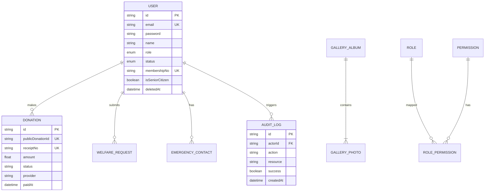

# LFDGCDP — Database Architecture & Schema Specification

**Engine**: SQLite (Development) / PostgreSQL (Production Target)  
**ORM**: Prisma Client v6  
**Schema File**: `backend/prisma/schema.prisma`

---

## Entity Relationship Diagram & Core Models

---

## Schema Summary Table

| Model Name | Primary Purpose | Soft Delete (`deletedAt`) | Key Indexes |
| :--- | :--- | :--- | :--- |
| `User` | Members, staff, & executive accounts | Yes | `email`, `membershipNo` |
| `Donation` | Financial receipts & payment records | Yes (Immutable semantics) | `publicDonationId`, `receiptNo` |
| `Project` | Community development projects | Yes | Primary Key |
| `Meeting` | Governance assemblies & minutes | Yes | Primary Key |
| `Grant` | Government PFMS grant tracking | Yes | Primary Key |
| `CulturalItem` | Heritage, music, & folklore archives | Yes | Primary Key |
| `HealthRecord` | Free rural medical camp logs | Yes | Primary Key |
| `Document` | Digital governance document library | Yes | `accessLevel` |
| `AuditLog` | Security & administrative audit trail | Immutable (No delete) | `actorId`, `action`, `createdAt` |
| `WelfareRequest` | Community relief claims | Yes | Primary Key |
| `EmergencyContact`| Emergency family contacts | No | Foreign Key `userId` |
| `News` | Foundation announcements | Yes | `slug` (Unique) |
| `Event` | Public events & calendar | Yes | Primary Key |
| `GalleryAlbum` | Photo album collections | Yes | Primary Key |
| `GalleryPhoto` | Individual album photos | Yes | Foreign Key `albumId` |
| `ContactMessage` | Public feedback & contact queries | No | Primary Key |
| `FoundationSetting`| CMS key-value configuration | No | `key` (Unique) |
| `Permission` | Granular permission definitions | No | `name` (Unique) |
| `RolePermission` | Role to permission mapping | No | Composite Unique `[role, permissionId]` |
