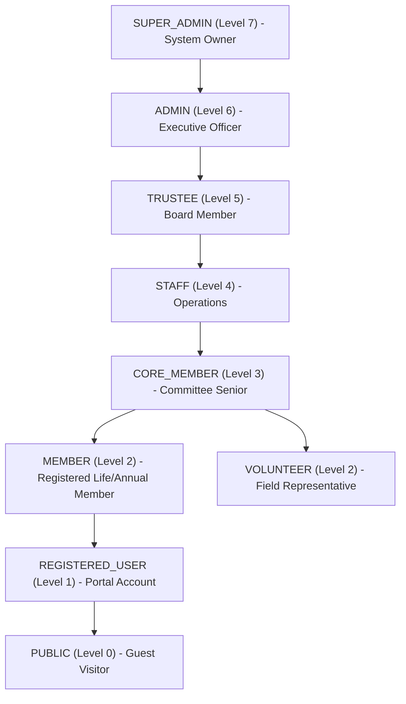

# LFDGCDP — Role-Based Access Control (RBAC) & Authorization Architecture

**Document Version**: 2.0.0  
**Status**: APPROVED & ENFORCED

---

## 1. Role Hierarchy

The Leimarembi Foundation platform supports 8 distinct access roles ordered by privilege level:

---

## 2. Granular Permission Definitions

| Permission Key | Description | Target Module | Default Roles Granted |
| :--- | :--- | :--- | :--- |
| `members:read` | View member directory roster | MEMBERS | `SUPER_ADMIN`, `ADMIN`, `TRUSTEE`, `STAFF`, `CORE_MEMBER` |
| `members:update` | Modify member details & status | MEMBERS | `SUPER_ADMIN`, `ADMIN` |
| `roles:manage` | Assign & promote user roles | MEMBERS | `SUPER_ADMIN` |
| `finance:read` | View donation & ledger records | FINANCE | `SUPER_ADMIN`, `ADMIN`, `TRUSTEE` |
| `finance:manage` | Reconcile bank transfers & status | FINANCE | `SUPER_ADMIN`, `ADMIN`, `TRUSTEE` |
| `welfare:read` | View welfare assistance claims | WELFARE | `SUPER_ADMIN`, `ADMIN`, `TRUSTEE`, `STAFF`, `CORE_MEMBER` |
| `welfare:submit` | Submit relief request | WELFARE | `SUPER_ADMIN`, `ADMIN`, `MEMBER` |
| `welfare:approve` | Review & disburse welfare claims | WELFARE | `SUPER_ADMIN`, `ADMIN`, `TRUSTEE` |
| `documents:read` | View digital library metadata | DOCUMENTS | `SUPER_ADMIN`, `ADMIN`, `TRUSTEE`, `STAFF`, `CORE_MEMBER`, `MEMBER`, `PUBLIC` |
| `documents:download`| Download restricted files | DOCUMENTS | Granted based on document `accessLevel` |
| `documents:upload`  | Upload digital library records | DOCUMENTS | `SUPER_ADMIN`, `ADMIN`, `TRUSTEE`, `STAFF` |
| `settings:read`   | View foundation system config | SETTINGS | `SUPER_ADMIN`, `ADMIN`, `STAFF`, `PUBLIC` |
| `settings:manage` | Update system config settings | SETTINGS | `SUPER_ADMIN` |
| `audit:read`      | Inspect system audit trail | AUDIT | `SUPER_ADMIN` |

---

## 3. Role × Permission × Endpoint Matrix

| Endpoint Route | HTTP Method | Required Role(s) | Required Permission | IDOR / Ownership Check |
| :--- | :--- | :--- | :--- | :--- |
| `/api/auth/register` | `POST` | `PUBLIC` | None | Self registration |
| `/api/auth/login` | `POST` | `PUBLIC` | None | Account status verified |
| `/api/auth/me` | `GET` | Authenticated | `PUBLIC` | Returns current identity |
| `/api/members` | `GET` | `SUPER_ADMIN`, `ADMIN`, `TRUSTEE`, `CORE_MEMBER`, `STAFF` | `members:read` | Excludes deleted records |
| `/api/members/:id/card` | `GET` | Authenticated | `members:read` | **IDOR Guard**: Rejects non-self requests unless privileged |
| `/api/members/:id/status` | `PATCH` | `SUPER_ADMIN`, `ADMIN` | `members:update` | Status toggle |
| `/api/members/:id/role` | `PATCH` | `SUPER_ADMIN` | `roles:manage` | Prevents privilege escalation |
| `/api/finance/donations/admin/all` | `GET` | `SUPER_ADMIN`, `ADMIN`, `TRUSTEE`, `STAFF` | `finance:read` | Filtered & paginated |
| `/api/finance/donations/admin/:id/status` | `PATCH` | `SUPER_ADMIN`, `ADMIN`, `TRUSTEE` | `finance:manage` | Verification note required |
| `/api/welfare/admin/all` | `GET` | `SUPER_ADMIN`, `ADMIN`, `TRUSTEE` | `welfare:read` | Excludes deleted claims |
| `/api/welfare/:id/status` | `PATCH` | `SUPER_ADMIN`, `ADMIN`, `TRUSTEE` | `welfare:approve` | Logs committee decision |
| `/api/documents` | `GET` | `PUBLIC` | `documents:read` | Excludes hidden & deleted docs |
| `/api/documents/:id/serve` | `GET` | Level-based | `documents:download` | Server checks `accessLevel` vs User Role |
| `/api/settings/admin/all` | `GET` | `SUPER_ADMIN`, `ADMIN` | `settings:read` | Exposes full settings |
| `/api/settings/:key` | `PUT` | `SUPER_ADMIN` | `settings:manage` | Audited |
| `/api/audit` | `GET` | `SUPER_ADMIN` | `audit:read` | Full system audit trail |

---

## 4. Privilege Escalation Protection Guarantees

1. **Role Modification Restrictions**: Only `SUPER_ADMIN` can modify user roles via `PATCH /api/members/:id/role`. An `ADMIN` user cannot promote themselves or anyone else to `SUPER_ADMIN`.
2. **Stale Token Invalidation**: `authenticateToken` queries the database on every request. If a user's role is demoted or status suspended in the DB, the change takes effect immediately regardless of unexpired JWT claims.
3. **IDOR Rejection**: `GET /api/members/:id/card` verifies `req.params.id === req.user.id` for regular members. Unauthorized attempts log security audit events (`IDOR_ATTEMPT_MEMBER_CARD`).
